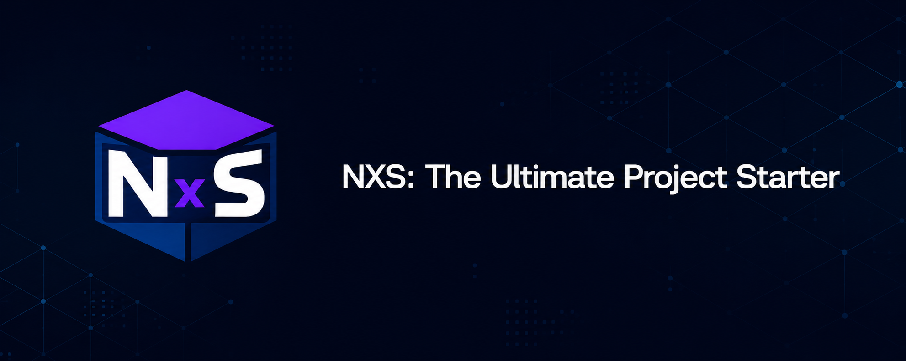

# NexicScript



NexicScript is the official CLI from the NexicScript organization for creating and expanding project structures with clean, categorized templates.

It is designed for public use, with a simple terminal workflow, separate template packages, and a professional brand identity.

## Brand

NexicScript uses a dark blue and purple visual identity.

- Dark blue: `#0B0F19`
- Purple: `#6D28D9`
- Blue: `#3B82F6`

The official logo is the file at [`branding/Logo.png`](./branding/Logo.png).

## Contact

For support, feedback, or publishing questions, write to [contact@nexicscript.org](mailto:contact@nexicscript.org).

## Install

```bash
npm install -g nexicscript
```

## First use

```bash
nxs help
```

Or open the guided template picker:

```bash
nxs templates
```

## What NexicScript does

NexicScript is split into a main CLI and independent template packages:

- `nexicscript` is the global CLI.
- `@nexicscript/template-web` contains web starters.
- `@nexicscript/template-backend` contains backend starters.
- `@nexicscript/template-scripting` contains scripting starters.
- `@nexicscript/template-games` contains game starters.
- `@nexicscript/template-mobile` contains mobile starters.
- `@nexicscript/template-data` contains data and machine learning starters.
- `@nexicscript/template-advanced` contains advanced platform starters.

## Supported templates

- Web: `web-basic`, `react-app`, `static-multi-page`, `vue-app`, `nextjs-app`, `svelte-app`
- Backend: `node-api`, `fullstack`, `discord-bot`, `rest-api-typescript`, `graphql-api`, `microservice`
- Scripting: `python-script`, `cli-tool`
- Games: `roblox-game`, `unity-game`, `godot-game`, `pygame-game`
- Mobile: `react-native-app`, `flutter-app`
- Data: `data-science`, `ml-model`
- Advanced: `chrome-extension`, `electron-app`, `monorepo`, `library-npm`

When a user chooses a template, NexicScript installs only the category package that is needed, then copies the template into the target folder.

## Commands

### `nxs create <template>`
Create a project from a specific template.

Examples:

```bash
nxs create web-basic
nxs create vue-app
nxs create nextjs-app
nxs create node-api
nxs create rest-api-typescript
```

`node-api` includes a prompt so the user can choose the API style:

- REST
- GraphQL

### `nxs templates`
Open the interactive menu and choose category + template step by step.

### `nxs list`
Show all categories, templates, and project add-ons.

Examples:

```bash
nxs list
nxs list --category backend
nxs list web
```

### `nxs list add`
Show only add-ons that can expand an existing project.

Examples:

```bash
nxs list add
```

### `nxs add <addon>`
Expand an existing project without overwriting the files already there.

Examples:

```bash
nxs add testing
nxs add docs
nxs add docker
nxs add ci-cd
```

### `nxs install <category>`
Install a template category pack ahead of time.

Examples:

```bash
nxs install web
nxs install backend
nxs install scripting
nxs install games
nxs install mobile
nxs install data
nxs install advanced
nxs install all
```

### `nxs info <template>`
Show template metadata and category information.

Example:

```bash
nxs info react-app
```

### `nxs help`
Show the command overview inside the terminal.

## Command flow

1. The user runs `nxs templates`, `nxs create`, `nxs list`, or `nxs add`.
2. NexicScript looks up the category or add-on definition.
3. If a category package is needed, NexicScript installs it silently in the background.
4. NexicScript copies only the selected template or add-on files into the destination.
5. Existing files are preserved unless the template explicitly adds new structure.

## Documentation

- [Brand guide](./docs/branding.md)
- [Command reference](./docs/commands.md)
- [Publishing notes](./docs/publishing.md)

## Publishing overview

NexicScript is structured for public publishing in two layers:

- the main CLI package on npm
- separate template packages for each template category

That approach keeps installs lighter, makes updates easier, and lets the organization grow templates independently.

## License

MIT
